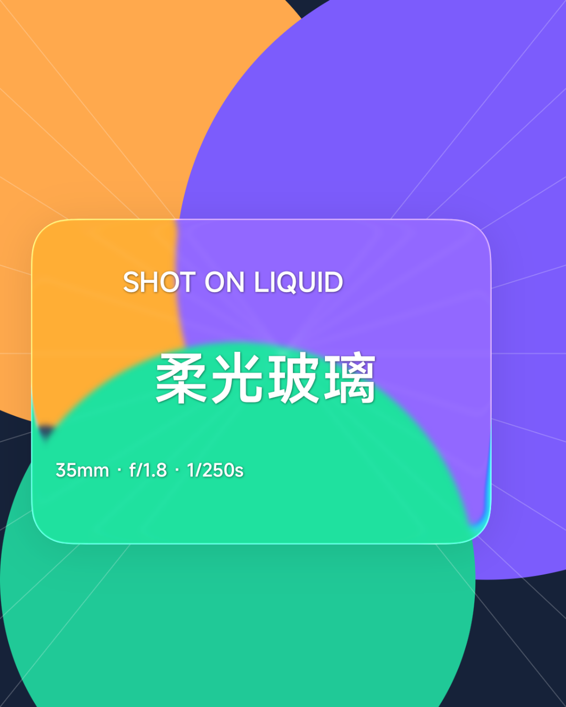
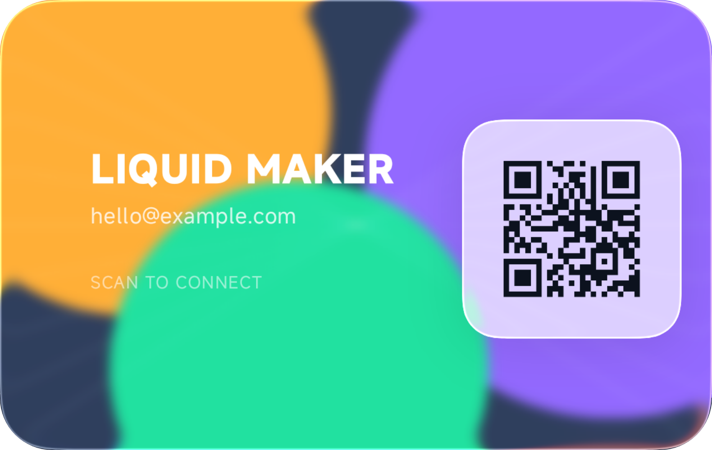

# Liquid Glass Lab

一个用于研究 Android 实时柔光玻璃效果的实验 App。项目基于 Jetpack Compose，并使用 [Kyant0/AndroidLiquidGlass](https://github.com/Kyant0/AndroidLiquidGlass) 相关的 `backdrop` / `shapes` 库实现背景采样、模糊、折射、高光和色散。

目前它不只是材质 Demo：已经包含玻璃参数实验台、自由玻璃铭牌、相机取景实验和二维码玻璃名片。

## 截图

<p align="center">
  
  
</p>

## 已实现

- 参数实验台：模糊、折射、圆角、明度等材质参数实时预览。
- 玻璃铭牌：导入照片，调整玻璃尺寸、位置、旋转与材质。
- 自由文字：添加多段文字，长按选中后拖动，并可调整字号、缩放和旋转。
- 无遮挡编辑：手机端参数坞停靠下侧，宽屏停靠右侧，调节时作品始终可见。
- 原作品导出：按作品画布渲染并导出，而不是截取整个 App 页面。
- 相机实验：实时取景背景上的可折射玻璃胶囊、闪光灯和变焦交互。
- 玻璃数字名片：自定义背景、文字、二维码、层级、尺寸、位置和玻璃材质。
- 模板、草稿、撤销与重做。

## 构建

要求：Android Studio / JDK 17，以及可用的 Android SDK。

```powershell
.\gradlew.bat :app:assembleDebug
```

Debug APK 位于：

```text
app/build/outputs/apk/debug/app-debug.apk
```

项目当前使用 `compileSdk 37`、`minSdk 23`，主要依赖版本已经固定在 [app/build.gradle.kts](app/build.gradle.kts)。首次构建需要从 Google Maven 和 Maven Central 下载依赖。

## 交互说明

铭牌与名片采用接近相册编辑器的逻辑：

1. 点击“编辑”进入对象编辑状态。
2. 长按作品内的文字或二维码进行选择。
3. 选中后直接拖动；详细参数从底部工具条进入。
4. 参数面板不会浮在作品中央，点击“收起”可恢复完整画布。
5. 点击顶部“保存”将作品渲染到系统相册。

## 项目边界

这里的玻璃效果工作在 App 自己的 Compose 渲染树内。它不是苹果 Liquid Glass 的代码移植，也不能让普通 Android 应用任意采样其他应用或系统窗口。相机、导出图像和二维码等功能仍应在不同设备上继续验证性能、色彩和扫码率。

## 致谢

- [Kyant0/AndroidLiquidGlass](https://github.com/Kyant0/AndroidLiquidGlass)
- [Kyant0/Backdrop](https://github.com/Kyant0/Backdrop)
- [ZXing](https://github.com/zxing/zxing)

本仓库当前作为实验项目维护。上游库及第三方依赖分别遵循其各自许可证。
